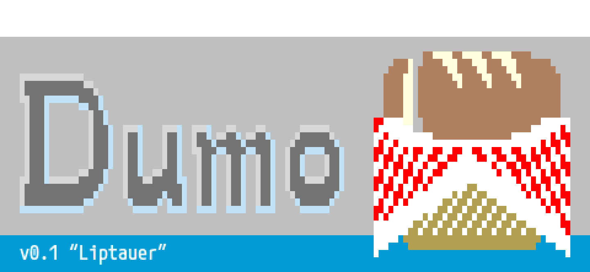
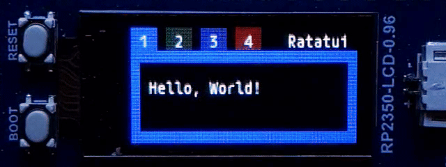
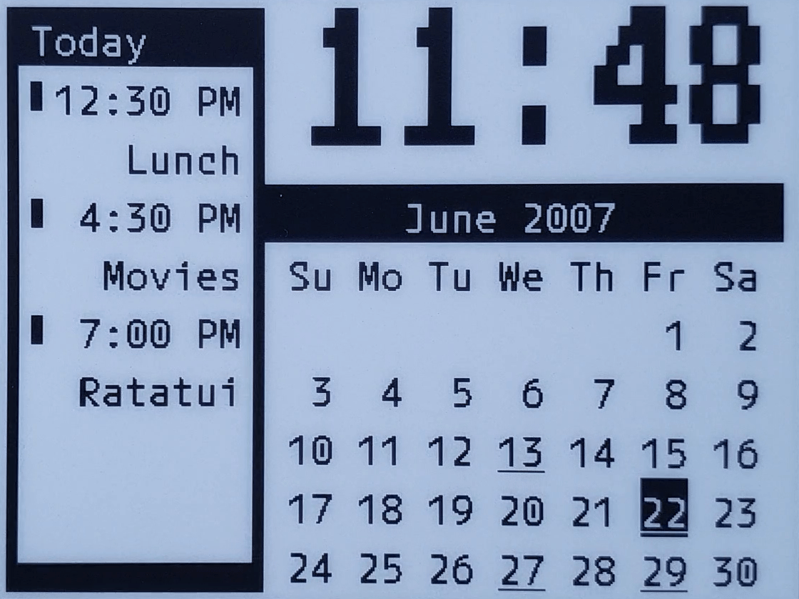

<picture>
    <source srcset="assets/dumo-0.1@3x.webp" type="image/webp" width="400" height="185" />
    
</picture>

**Dumo** ([/ˈduːmoʊ/](https://ipa-reader.com/?text=%CB%88du%CB%90mo%CA%8A), pronounced `doo-mo`;
from _dumó_, meaning back, tail-end, end-piece of a bread loaf) is an [`embedded-graphics`] backend
for [`ratatui`] v0.30.0 “Bryndza” built on the [`ratatui-core`] crate.

Build terminal-style user interfaces for small low-resolution displays, such as this 160×80 screen…

<picture>
    <source srcset="assets/ratatui-tabs-cropped.webp" type="image/webp" width="320" height="120" />
    
</picture>

***M+ Code** font in a Ratatui [Tabs](https://ratatui.rs/examples/widgets/tabs) widget.*

<picture>
    <source srcset="assets/epd-calendar-cropped.webp" type="image/webp" width="400" height="300" />
    
</picture>

*An e-Paper display with only black and white pixels, showing three ingredients:*

- *Ratatui [List](https://ratatui.rs/examples/widgets/list) widget (left ⅓)*
- *Ratatui [Calendar](https://ratatui.rs/examples/widgets/calendar) widget (lower-right ⅔)*
- *`tui-big-text` from [`tui-widgets`]*

… or how about a display with a lot of pixels — for an SPI interface, at least — like the one found
on this 4.2″ EPD module, which has a resolution of 400×300?

The [`dumo`] crate and its [`fonts`] module contains preconfigured [`mplusfonts`] bitmap fonts with
six line heights, for starters: 6×18, 8×24, 10×30, 12×36, 14×42, and 16×48. The calendar above uses
a character cell size of **12**×30 pixels since, in addition to the six basic ones, there are three
presets for 125% width bitmap fonts: 8×20, 12×30, 16×40; and one that has a width of 115%, the 6×16
bitmap font, which can be seen in the first example with the Ratatui tabs.

There are two additional bold presets for the 8×24 and 12×36 bitmap fonts, making it a total of 12.

Although it would be possible, there are no presets for cell sizes smaller than 6×16 pixels because
`mplusfonts` creates glyph images from TrueType fonts. The designer of these fonts, Coji Morishita,
has done an excellent job aligning glyph outlines with the pixel grid at the font sizes used in the
presets, but if you have less pixels to work with or would prefer another font, a pixel font, check
out [`mousefood`], the Ratatui backend for `embedded-graphics`.

While pixel fonts are optimized for 1 bit per pixel and take up less storage space, `dumo` supports
1, 2, 4, and 8 bits per pixel in its glyph images; therefore, font anti-aliasing is possible if the
display also has a high enough bit depth. This is the recommended use case for `dumo`, even though,
as shown in the calendar example, 1 bit per pixel is supported, the uneven line thickness — as seen
in the letter **R** for Ratatui — is unavoidable, given that the current edition of **M+
FONTS** is not a per-pixel-drawn bitmap font.

Bit depth aside, `dumo` makes it possible to reduce the amount flash memory that a bitmap font uses
either by not enabling the subsets of glyphs that are not required — for example, Braille patterns,
which are one type of [`Marker`] in Ratatui and a popular choice of characters for a [`throbber`] —
or through the use of a macro in the [`dumo`] crate root, bypassing the [`fonts`] module and adding
character ranges and strings that need to be made renderable, using one of the presets. The presets
can also be replaced with a call to the [`mpluscode!`] macro; however, the font weights used in the
presets have been pre-calculated, balancing out the left and right halves of glyph images such that
anti-aliasing artifacts would appear symmetrical.

[`embedded-graphics`]: https://crates.io/crates/embedded-graphics
[`ratatui`]: https://crates.io/crates/ratatui/0.30.0
[`ratatui-core`]: https://crates.io/crates/ratatui-core/0.1.0
[`tui-widgets`]: https://crates.io/crates/tui-widgets
[`dumo`]: https://docs.rs/dumo/latest/dumo/index.html
[`fonts`]: https://docs.rs/dumo/latest/dumo/fonts/index.html
[`mplusfonts`]: https://docs.rs/mplusfonts/latest/mplusfonts/index.html
[`mousefood`]: https://docs.rs/mousefood/latest/mousefood/index.html
[`Marker`]: https://docs.rs/ratatui/latest/ratatui/prelude/symbols/enum.Marker.html
[`throbber`]: https://docs.rs/throbber-widgets-tui/latest/throbber_widgets_tui/index.html
[`mpluscode!`]: https://docs.rs/dumo/latest/dumo/macro.mpluscode.html

## Minimum supported Rust version

The minimum supported Rust version for `dumo` is `1.89`.

## License

The source code of `dumo` is dual-licensed under:

* Apache License, Version 2.0 ([LICENSE-APACHE] or <http://www.apache.org/licenses/LICENSE-2.0>)
* MIT License ([LICENSE-MIT] or <http://opensource.org/licenses/MIT>)

at your option.

[LICENSE-APACHE]: LICENSE-APACHE
[LICENSE-MIT]: LICENSE-MIT
