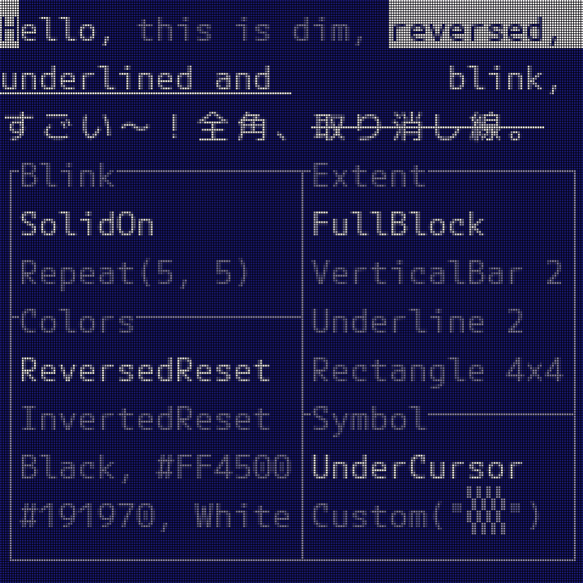
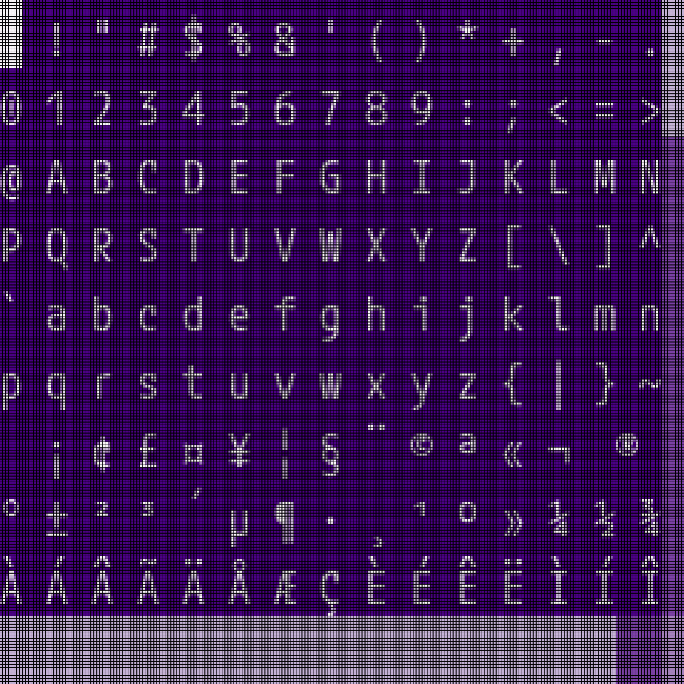

# Dumo examples

## Running the simulator

The examples found in this folder use `embedded-graphics-simulator` instead of specific hardware to
demonstrate how Ratatui and the Dumo backend draw styled text to a display device. You can run them
on a local machine after cloning the repository as long as a graphical user interface is available.

Follow the [simulator setup instructions] available at the `embedded-graphics-simulator` repository
if you are running the examples for the first time.

[simulator setup instructions]: https://github.com/embedded-graphics/simulator#setup

## Clock animation

Usage: `cargo run --example clock`

### Instructions

* Press and hold `SPACE` or `RETURN` to change colors
* Press `ESC` to quit

This example renders the [`RatatuiLogo`] and shows the time using block elements — with the help of
the [`tui-big-text`] crate. The screen resolution is 240×240 pixels, and the bitmap font has a cell
size of 6×16 pixels.

<picture>
    <source srcset="https://raw.githubusercontent.com/iddey/dumo/refs/heads/main/assets/clock-animation.webp" type="image/webp" width="480" height="480" />
    
</picture>

[`RatatuiLogo`]: https://docs.rs/ratatui/latest/ratatui/widgets/struct.RatatuiLogo.html
[`tui-big-text`]: https://crates.io/crates/tui-big-text

## Built-in palettes

Usage: `cargo run --example palettes`

### Instructions

* Press `SPACE` or `RETURN` to cycle through palettes
* Press `ESC` to quit

Learn more about using color names and index codes — in addition to 24-bit color codes — at Ratatui
examples: <https://ratatui.rs/examples/style/colors/>

The palettes shown here are provided by the [`Palettes`] trait. The bitmap font in this example can
only render the full block character at a size of 6×16 pixels to fill an area of 240×240 pixels.

<picture>
    <source srcset="https://raw.githubusercontent.com/iddey/dumo/refs/heads/main/assets/built-in-palettes.webp" type="image/webp" width="480" height="480" />
    
</picture>

[`Palettes`]: https://docs.rs/dumo/latest/dumo/color/trait.Palettes.html

## Style modifiers

Usage: `cargo run --example styles-1`

### Instructions

* Press `DOWN` or `J` or `TAB` to select the next modifier
* Press `UP` or `K` or `SHIFT` + `TAB` to select the previous modifier
* Press `SPACE` or `RETURN` to toggle the selected modifier on and off
* Press `ESC` to quit

The effects demonstrated in this example — except for *`ITALIC`*, which lacks support and is absent
 — are all possible terminal-style [`Modifier`] flags that are available through Ratatui with Dumo,
also with varying levels of support elsewhere: <https://ratatui.rs/examples/style/modifiers/>

Modifiers can be added to and removed from the styled sample text, showing how composition of these
effects work; however, it requires running the example.

[`Modifier`]: https://docs.rs/ratatui/latest/ratatui/style/struct.Modifier.html

<picture>
    <source srcset="https://raw.githubusercontent.com/iddey/dumo/refs/heads/main/assets/style-modifiers.webp" type="image/webp" width="480" height="480" />
    
</picture>

## Cursor settings

Usage: `cargo run --example cursor-1`

### Instructions

* Press the arrow keys or `H`, `J`, `K`, `L`, to move the cursor to one of the list boxes
* Press `SPACE` or `RETURN` to use the item that the cursor is hovering over
* Press `ESC` to quit

Sometimes, terminal-style applications need to show a cursor, and Dumo can provide one for widgets,
rendering the visual element of text entry.

This example allows the user to customize the appearance of the cursor indicator, using the cursor
itself in the process. There are also spans of styled text demonstrating what the cursor will look
like when moved to those positions.

<picture>
    <source srcset="../assets/cursor-settings.webp" type="image/webp" width="480" height="480" />
    
</picture>

## Cursor example #2 - Glyphset viewer

Usage: `cargo run --example cursor-2 --features="font-8x24 font-8x24-bold font-4-bits"`

### Instructions

* Press the arrow keys or `H`, `J`, `K`, `L`, to move the cursor and scroll the table
* Press `SPACE` or `RETURN` to cycle through sets of glyphs
* Press `TAB` to switch between regular and bold fonts
* Press `ESC` to quit

Renders tables of glyph subsets that correspond to the features that are enabled by default, which
allows for visual inspection of the bitmap fonts, in this case, `font-8x24` and `font-8x24-bold`.

The tables contain special textual data, which are also used to populate the bitmap fonts with the
characters that they ought to include in their character sets. The tables are exhaustive, all base
characters — supported by the underlying TrueType font or backed by vector graphics — are added to
their respective subsets.

<picture>
    <source srcset="../assets/cursor-glyphset.webp" type="image/webp" width="480" height="480" />
    
</picture>
