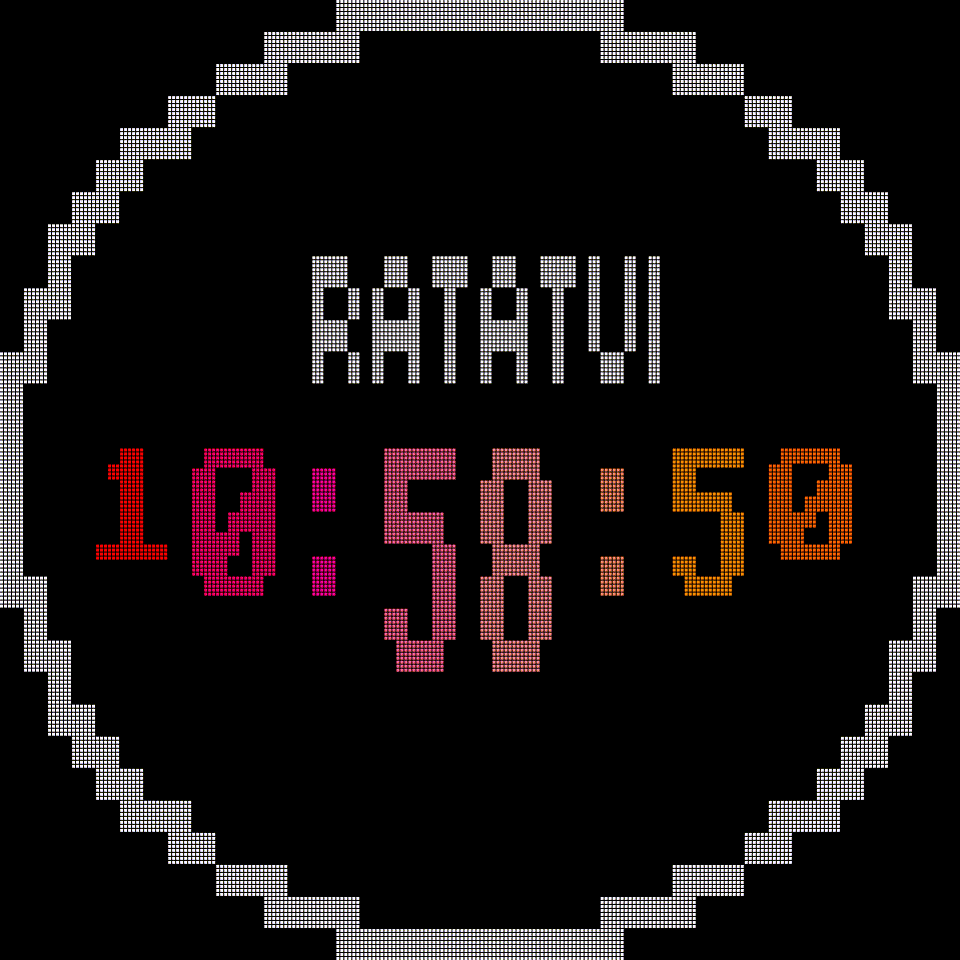
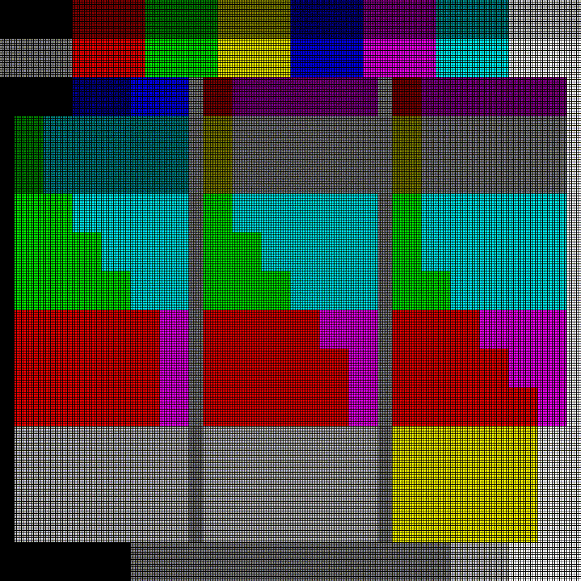

# Dumo examples

## Running the simulator

The examples found in this folder use `embedded-graphics-simulator` instead of specific hardware to
demonstrate how Ratatui and the Dumo backend draw styled text to a display device. You can run them
on a local machine after cloning the repository as long as a graphical user interface is available.

Follow the [simulator setup instructions] available at the `embedded-graphics-simulator` repository
if you are running the examples for the first time.

[simulator setup instructions]: https://github.com/embedded-graphics/simulator#setup

## Clock animation

Usage: `cargo run --example clock`

### Instructions

* Press and hold `SPACE` or `RETURN` to change colors
* Press `ESC` to quit

This example renders the [`RatatuiLogo`] and shows the time using block elements — with the help of
the [`tui-big-text`] crate. The screen resolution is 240×240 pixels, and the bitmap font has a cell
size of 6×16 pixels.

<picture>
    <source srcset="../assets/clock-animation.webp" type="image/webp" width="480" height="480" />
    
</picture>

[`RatatuiLogo`]: https://docs.rs/ratatui/latest/ratatui/widgets/struct.RatatuiLogo.html
[`tui-big-text`]: https://crates.io/crates/tui-big-text

## Built-in palettes

Usage: `cargo run --example palettes`

### Instructions

* Press `SPACE` or `RETURN` to cycle through palettes
* Press `ESC` to quit

Learn more about using color names and index codes — in addition to 24-bit color codes — at Ratatui
examples: <https://ratatui.rs/examples/style/colors/>

The palettes shown here are provided by the [`Palettes`] trait. The bitmap font in this example can
only render the full block character at a size of 6×16 pixels to fill an area of 240×240 pixels.

<picture>
    <source srcset="../assets/built-in-palettes.webp" type="image/webp" width="480" height="480" />
    
</picture>

[`Palettes`]: https://docs.rs/dumo/latest/dumo/color/trait.Palettes.html
